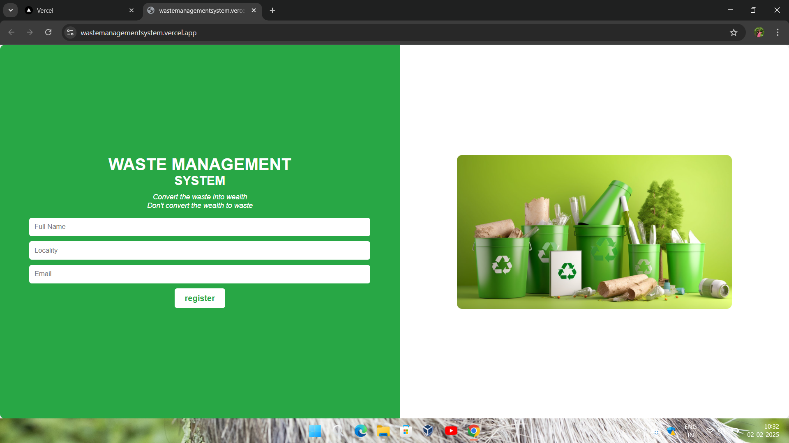
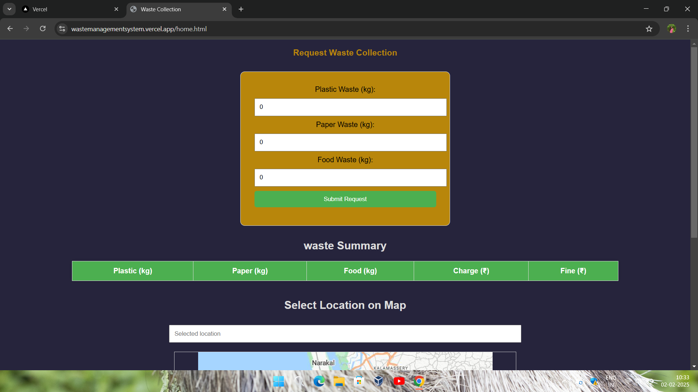
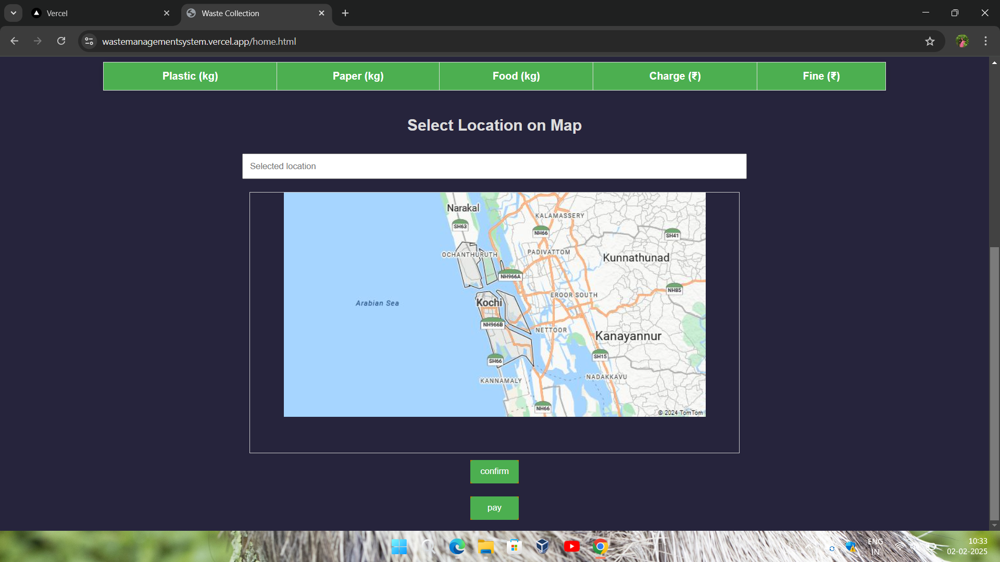

# [Waste Management website] 🎯

## Basic Details
### Team Name: [Hexas..]

### Team Members
- Member 1: [Aiswarya R] - [College of engineering,adoor]
- Member 2: [Aiswarya S] - [College of engineering ,adoor]
- Member 3: [Amritha P] - [College of engineering, adoor]

### Hosted Project Link
[mention your project hosted project link here]

### Project Description
[It is waste management website used to collect wastes from user regsitered in the site by charging a certain amount for plastic , paper ,food seperately]

### The Problem statement
[To control the over generating of waste and to follow sustainable way of despositing it]

### The Solution
[plastic waste upto 10 kg charges 5 rupeees per kg,paper waste upto 10kg charges 5 rupees per kg,food waste upto 10kg charges 10 rupees per kg,incase of  ]

## Technical Details
### Technologies/Components Used
For Software:
- [HTML,css,javascript]
- [Frameworks used]
- [Libraries used]
- [Tools used]

For Hardware:
- [List main components]
- [List specifications]
- [List tools required]

### Implementation
For Software:
# Installation
[commands]

# Run
[commands]

### Project Documentation
For Software:

# Screenshots (Add at least 3)

*Add caption explaining what this shows*

caption explaining what this shows*

*Add caption explaining what this shows*

# Diagrams

*Add caption explaining your workflow*

For Hardware:

# Schematic & Circuit

*Add caption explaining connections*

*Add caption explaining the schematic*

# Build Photos

*List out all components shown*

*Explain the build steps*

*Explain the final build*

### Project Demo
# Video
[https://drive.google.com/file/d/1NO_ZBVZgFC8H8mwVmPX4j00SO6C4ul03/view?usp=sharing]
*Explain what the video demonstrates*

# Additional Demos
[Add any extra demo materials/links]

## Team Contributions
- [Name 1]: [Specific contributions]
- [Name 2]: [Specific contributions]
- [Name 3]: [Specific contributions]

---
Made with ❤️ at TinkerHub
